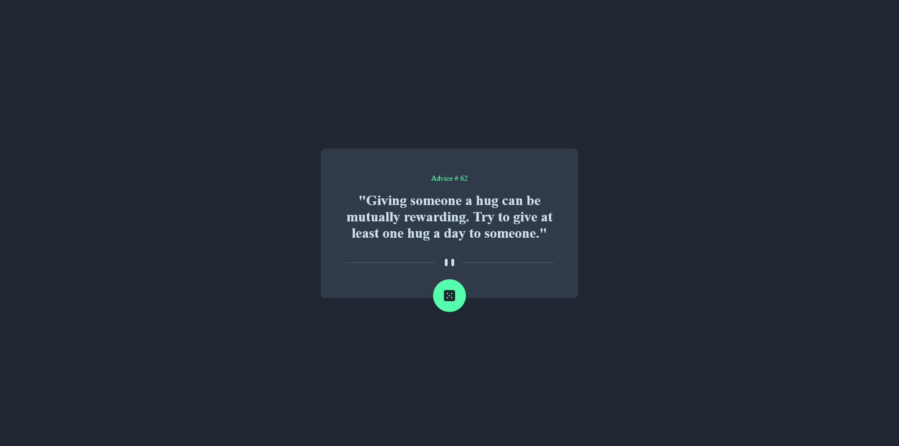

# advice-generator

## Table of contents

- [Overview](#overview)
  - [The challenge](#the-challenge)
  - [Screenshot](#screenshot)
  - [Links](#links)
- [My process](#my-process)
  - [Built with](#built-with)
  - [Continued development](#continued-development)
- [Author](#author)

## Overview

### The challenge

Users should be able to:

- View the optimal layout for the app depending on their device's screen size
- See hover states for all interactive elements on the page
- Generate a new piece of advice by clicking the dice icon

### Screenshot

### Links

- Live Site URL: [Add live site URL here](https://ahmedmekkawy27.github.io/advice-generator/)

## My process

### Built with

- [React](https://reactjs.org/) - JS library
- CSS custom properties
- Flexbox

### Continued development

I'm still learning react, so I would still like to improve the performance of the app, and probably add more advices to it.
## Author
- Frontend Mentor - [AhmedMekkawy27](https://www.frontendmentor.io/profile/AhmedMekkawy27)
